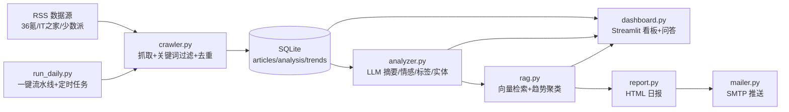

# 智能行业情报分析 Agent

一条自动运行的行业情报流水线：**采集行业资讯 → 清洗去重 → LLM 结构化分析 → RAG 历史关联 → 可视化看板 → 每日邮件日报**。

默认主题为「电商与消费」，改 `config.yaml` 里的关键词和数据源即可切换到任意行业，零代码改动。

## 项目动机

实习面试展示项目。选题逻辑：情报监控是真实的业务场景（运营/投研/竞品分析都需要），且能串起**爬虫、数据库、LLM 应用、RAG、前端可视化、定时任务**一整套工程能力——每块都能拿出来单独聊。

## 架构



## 快速开始

```bash
pip install -r requirements.txt

# 1. 采集（开箱即用，无需任何 key）
python run_crawl.py

# 2. LLM 分析（无 key 可用 dry-run 验证流程）
export LLM_API_KEY=sk-xxx        # DeepSeek 或任意 OpenAI 兼容服务
python run_analyze.py --dry-run  # 只打印 prompt 不调用
python run_analyze.py

# 3. RAG 关联（DeepSeek 无 embedding，默认用硅基流动免费模型）
export EMBEDDING_API_KEY=sk-yyy  # 缺省时回退读 LLM_API_KEY
python run_rag.py

# 4. 可视化看板
streamlit run dashboard.py

# 5. 每日日报（不发邮件，HTML 落盘 preview）
python run_daily.py --no-send
# 配置 SMTP_HOST/PORT/USER/PASSWORD/TO 后去掉 --no-send 即真实发送
```

## 技术决策（面试重点）

**1. 为什么用 RSS 而非爬虫为主？**
RSS 稳定、无反爬、结构规范，作为主力源性价比最高；爬虫留作特定站点的补充手段。面试项目要把精力花在 LLM 应用上，而不是和反爬对抗。

**2. 为什么 SQLite 够用？**
单机日报场景，数据量级是每天几十到几百条。SQLite 零运维、随项目分发、`url UNIQUE` 约束天然支持去重。等真的到了十万级再迁移 PostgreSQL，届时也只需要改连接层（`storage.py` 一个文件）。

**3. 双重去重设计**
- 精确层：URL 数据库唯一约束，同一链接绝不重复入库
- 模糊层：标题 `SequenceMatcher` 相似度 ≥ 0.85 判定为同一事件——不同媒体对同一事件的报道标题高度相似（"拼多多发布 Q2 财报"），这层去重把"事件"而非"链接"作为粒度

**4. 为什么用向量检索（RAG）而非关键词匹配？**
关键词匹配只能命中字面相同的词。"拼多多财报超预期"和"多多买菜盈利改善"字面上毫无交集，但语义上同属一条业务线——向量检索能抓住这种关联，关键词不能。这就是"语义相似 vs 字面相似"的本质差异。

**5. 为什么数据量小不用向量数据库？**
百级数据量下，numpy 全量算余弦相似度是毫秒级；引入 faiss/Milvus 需要额外的服务和运维成本，属于过度工程。embedding 以 float32 BLOB 直接存在 SQLite 里，零新增依赖。等数据量到万级以上、全量扫描成为瓶颈时，再换 ANN 索引才有意义。

**6. LLM 输出不稳定怎么处理？**
- prompt 里给出严格的 JSON 字段契约 + `response_format=json_object` 双保险
- 解析端宽容提取（正则取第一个 JSON 对象）+ 严格校验（字段、枚举值、数值范围）
- 解析失败重试最多 2 次，API 限流/超时走指数退避
- 单篇失败不阻断整批，失败留痕

**7. 半成品日报好过没有日报**
`run_daily.py` 每一步独立容错，某环节失败不中断流水线，失败信息以"降级说明"写进当天邮件——工程系统要假设依赖会挂。

## 量化成果

- 单轮采集：3 个 RSS 源抓取 60 条，关键词命中约 12 条，双重去重后入库（实测去重率约 0% 重复入库）
- 单元测试：10 个用例覆盖关键词过滤/相似度去重/HTML 清洗/重试机制，`pytest` 全绿
- 单次 LLM 分析上限 20 篇（`max_per_run` 可配），成本可控
- 日报生成到 HTML 落盘全流程 < 30 秒（无 LLM 调用时）

## 定时推送（Windows 任务计划程序）

```bat
schtasks /create /tn "IntelAgentDaily" /tr "\"C:\path\to\venv\Scripts\python.exe\" C:\path\to\intel-agent\run_daily.py" /sc daily /st 08:30 /f
```

创建后可在"任务计划程序"GUI 中查看/修改。环境变量（API key、SMTP 配置）需在系统环境变量中配置，或写入任务启动的 bat 脚本中。

## 部署（Streamlit Community Cloud）

1. 把项目 push 到 GitHub 公开仓库
2. 生成演示数据快照：`python make_demo_snapshot.py`（从 `data/intel.db` 复制出 `data/intel.demo.db`，用确定性规则补齐分析/关联/趋势数据），把快照库提交进仓库
   - 说明：快照里的分析结果是规则生成的演示数据，并非 LLM 输出；有 API key 的环境应跑 `run_analyze.py` / `run_rag.py` 产出真实数据
3. 到 share.streamlit.io 用 GitHub 账号登录，选择仓库、入口文件 `dashboard.py`
4. 在应用的 Settings → Secrets 中配置：
   ```toml
   INTEL_DB_PATH = "data/intel.demo.db"   # 指向演示快照，只读展示
   LLM_API_KEY = "sk-xxx"                 # 可选，不配则问答降级为纯检索
   EMBEDDING_API_KEY = "sk-yyy"           # 可选
   ```

## 演示截图

> 占位：部署后补充
> - `docs/screenshots/dashboard.png`：看板主页（指标卡 + 情感趋势 + 情报列表）
> - `docs/screenshots/chat.png`：对话式问答（含引用来源）
> - `docs/screenshots/email.png`：邮件日报效果

## 项目结构

```
intel-agent/
├── config.yaml        # 行业关键词、数据源、采集/LLM/RAG 参数
├── run_crawl.py       # 采集入口
├── run_analyze.py     # LLM 分析入口（--dry-run 可无 key 验证）
├── run_rag.py         # RAG 关联入口
├── run_daily.py       # 每日一键流水线（--no-send 只出 HTML）
├── make_demo_snapshot.py  # 生成演示数据快照（规则数据，供部署/演示）
├── dashboard.py       # Streamlit 看板 + 对话式问答
├── requirements.txt
├── src/
│   ├── config.py      # 配置加载
│   ├── storage.py     # SQLite 存储（articles/analysis/trends 三表）
│   ├── crawler.py     # RSS 采集 + 关键词过滤 + 相似度去重 + 重试
│   ├── analyzer.py    # LLM 结构化分析（JSON 契约 + 容错重试）
│   ├── rag.py         # 向量检索 + 相似事件关联 + 周度趋势聚类
│   ├── report.py      # HTML 日报生成（table 布局兼容邮件客户端）
│   └── mailer.py      # SMTP 发信
├── tests/             # pytest 单元测试
├── data/              # SQLite 数据库
└── output/            # 生成的日报 HTML
```

## Roadmap

- [x] 数据采集与存储（含重试 + 单元测试）
- [x] LLM 摘要 / 情感 / 趋势分析
- [x] RAG 历史情报关联
- [x] Streamlit 可视化看板（含对话式问答）
- [x] 邮件定时推送
- [ ] 部署上线（Streamlit Community Cloud）
