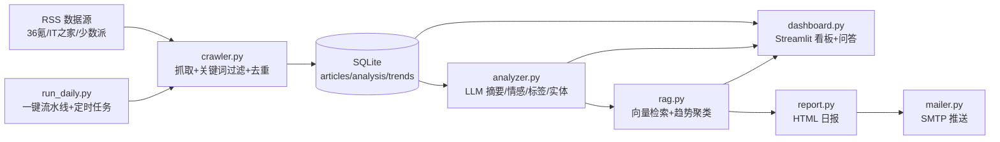

# 架构设计

## 1. 系统全景

一条自动运行的行业情报流水线：**采集行业资讯 → 清洗去重 → LLM 结构化分析 → RAG 历史关联 → 可视化看板 → 每日邮件日报**。默认主题「电商与消费」，改 `config.yaml` 即可切换任意行业，零代码改动。



## 2. 模块职责

| 模块 | 职责 | 关键设计点 |
|---|---|---|
| `config.yaml` | 行业关键词、数据源、采集/LLM/RAG 参数 | 换行业只改配置；API Key 只存环境变量名，绝不入文件 |
| `src/config.py` | 配置加载 | YAML + 环境变量覆盖（base_url / model / key 均可覆盖） |
| `src/storage.py` | SQLite 持久化 | `url UNIQUE` 精确去重；`_ensure_column` 轻量迁移补列；分析写库用事务保证两表一致 |
| `src/crawler.py` | RSS 采集 | 关键词命中过滤 + 标题 `SequenceMatcher` 相似度 ≥0.85 模糊去重；超时重试 2 次 |
| `src/analyzer.py` | LLM 结构化分析 | JSON 字段契约 + `response_format=json_object` + 宽容提取/严格校验 + 失败重试 2 次 |
| `src/rag.py` | RAG 历史关联 | embedding 以 float32 BLOB 存 SQLite；numpy 全量余弦；阈值 0.6；Top-3 相似事件 |
| `src/report.py` | HTML 日报生成 | table 布局兼容邮件客户端；每步独立容错，失败降级写入说明 |
| `src/mailer.py` | SMTP 推送 | 未配置 SMTP 时 `--no-send` 只落盘 HTML |
| `dashboard.py` | Streamlit 看板 | 指标卡 / 情感趋势 / 情报列表 / 对话式问答 / 一键采集 / 关键词在线配置 |
| `make_demo_snapshot.py` | 演示快照 | 从 `intel.db` 生成确定性规则数据，供无 Key 部署演示 |
| `run_crawl.py` / `run_analyze.py` / `run_rag.py` / `run_daily.py` | 各阶段入口 | 均支持 `--dry-run`，无 API Key 也能验证流程 |

## 3. 数据模型

SQLite 三张表，存储访问全部收敛在 `src/storage.py`（后续迁移数据库只改这一个文件）：

| 表 | 关键字段 | 说明 |
|---|---|---|
| `articles` | `url`(UNIQUE) / `title` / `summary` / `source` / `published` / `fetched_at` / `analyzed` / `embedding`(BLOB) / `related_event`(JSON) | 情报主表；URL 唯一约束做精确去重；RAG 字段用轻量迁移追加 |
| `analysis` | `article_id`(PK) / `summary_ai` / `sentiment` / `sentiment_conf` / `tags` / `entities` / `tokens_used` / `analyzed_at` | LLM 结构化分析结果，1:1 关联文章，token 用量用于成本核算 |
| `trends` | `week_start` / `cluster`(JSON) / `content` / `created_at` | 周度趋势聚类：一组相关事件 + LLM 提炼的趋势段落 |

## 4. 关键设计决策（面试故事线）

**4.1 为什么用 RSS 而非爬虫为主？**
RSS 是官方开放订阅接口，稳定、无反爬、结构规范，性价比最高；爬虫留作特定站点补充。把精力放在 LLM 应用上，而不是和反爬对抗。

**4.2 双重去重设计**
- 精确层：`url` 数据库唯一约束，同一链接绝不重复入库
- 模糊层：标题相似度 ≥0.85 判定为同一事件——不同媒体对同一事件报道的标题高度相似，这层把"事件"而非"链接"作为去重粒度

**4.3 为什么 SQLite 够用？**
单机日报场景每天几十到几百条，SQLite 零运维、随项目分发；等十万级再迁移 PostgreSQL，存储访问收敛在 `storage.py` 一个文件，迁移成本可控。

**4.4 为什么用向量检索而非关键词匹配做历史关联？**
"拼多多财报超预期"和"多多买菜盈利改善"字面无交集，但语义上同属一条业务线。关键词匹配只能命中字面相同的词，向量检索度量的是语义距离。

**4.5 为什么数据量小不上向量数据库？**
百级数据量下 numpy 全量算余弦是毫秒级；faiss/Milvus 的优势要到十万级以上才体现。embedding 以 BLOB 直接存 SQLite，零新增基础设施——技术选型匹配规模，检索逻辑独立预留升级路径。

**4.6 LLM 输出不稳定怎么兜底？**
prompt 字段契约 + `response_format=json_object` + 宽容提取/严格校验 + 重试 2 次 + 失败留痕不阻断整批。不把 LLM 当确定性函数用，用工程手段兜底。

**4.7 降级策略**
看板在无 embedding key 时自动降级关键词检索；日报生成每一步独立容错，某环节失败把"降级说明"写进当天邮件。工程系统要假设依赖会挂。

## 5. 演进路线（"如果重做"题）

```
SQLite + numpy 全量余弦（当前，百级数据）
  └─ 数据量到万级：faiss/hnswlib ANN 索引（改 src/rag.py 检索层一处）
      └─ 十万级+：PostgreSQL + pgvector / Milvus（改 storage.py 连接层）
          └─ 信源扩展：微信公众号/微博/雪球（补充爬虫与反爬策略）
              └─ 事件级聚合：相似标题 → 真正的事件实体与时间线
                  └─ 告警通道：负面高置信度事件实时推微信/钉钉 webhook
```

每一个演进点都是面试官爱问的"为什么这么设计 / 边界在哪 / 怎么验证"。

